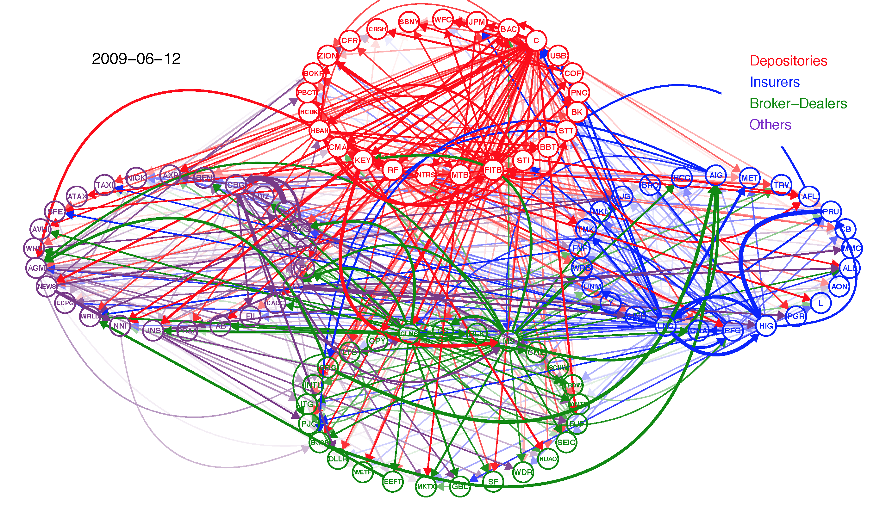
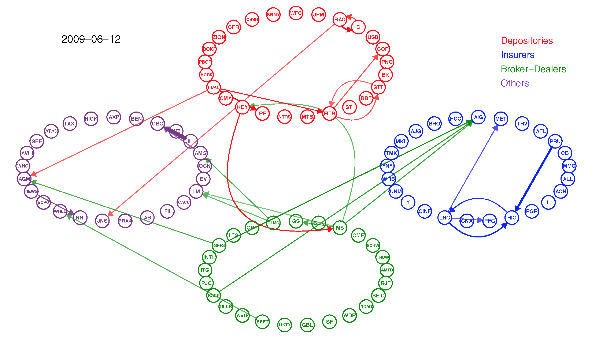

[](http://quantlet.de/)

## [](http://quantlet.de/) **TENET_group_network** [](http://quantlet.de/)

```yaml

Name of QuantLet : TENET_group_network

Published in : TENET

Description : 'Plots the network based on an adjacency matrix before and after thresholding, so
that we can see the directional connection caused by spillover effects among 100 financial
institutions.'

Keywords : tail, quantile regression, CoVaR, systemic Risk, variable selection, dimension reduction

Author : Lining Yu

Datafile : 100_firms_returns_and_macro_2015-04-15.csv, totc_JPM_t_80.csv

Example : 'Plot of a group network graph before the thresholding, Plot of a group network graph
after the thresholding'

```






### R Code:
```r
# clear all variables
rm(list = ls(all = TRUE))
graphics.off()

# install and load packages
libraries = c("qgraph")
lapply(libraries, function(x) if (!(x %in% installed.packages())) {
  install.packages(x)
})
lapply(libraries, library, quietly = TRUE, character.only = TRUE)

# set the working directory setwd('C:/...')

# read firms' data
f = read.csv("100_firms_returns_and_macro_2015-04-15.csv")
# read the connectedness matrix based on estimated paritial derivatives on
# 12_06_2009 as an example
con      = as.matrix(read.csv("totc_JPM_t_80.csv")[, -1])

# extract the date
dt       = as.Date(f[, 1], format = "%d/%m/%Y")[49:314]

# read the returns of 100 firms, the seven macro variables are ruled out
ff       = f[, 2:(ncol(f) - 7)]
# read the firms' names
names.fi = colnames(f)[2:101]

# divide the firms into four groups: Depositories, Insurers, Broker-Dealers,
# Others.
groups   = list(1:25, 26:50, 51:75, 76:100)

col      = c(rep("red", 25), rep("blue", 25), rep("green4", 25), rep("mediumorchid4", 
  25))

# plot a network based on the adjacency matrix 'con' before thresholding, so that
# we can see the directional connection caused by spillover effects among 100
# financial institutions.
plot_g = qgraph(con, groups = groups, layout = "groups", layoutScale = c(1.2, 1.2), 
  label.font = 2, label.cex = 2, shape = "circle", labels = names.fi, esize = 5, 
  maximum = max(con), color = "white", node.width = 0.8, label.cex = 1.8, label.color = col, 
  edge.color = col, curve = 1, border.width = 1.2, border.color = col, asize = 2.5)
text(x = -0.9, y = 1, labels = substitute(paste(d), list(d = as.character(dt[80]))), 
  xpd = NA, cex = 1.5)
legend(0.82, 1.1, box.lwd = 2, box.col = "white", bg = "white", c("Depositories", 
  "Insurers", "Broker-Dealers", "Others"), text.col = c("red", "blue", "green4", 
  "purple3"), cex = 1.3)

# apply a hard thresholding to make the major connections more clearly
con = ifelse(abs(con) >= ((1/100) * sum(con[order(con, decreasing = T)[1:100]])), 
  con, 0)

# plot a network based on the adjacency matrix 'con' after thresholding, so that
# we can see the directional connection caused by spillover effects among 100
# financial institutions.
plot_g = qgraph(con, groups = groups, layout = "groups", layoutScale = c(1.2, 1.2), 
  label.font = 2, label.cex = 2, shape = "circle", labels = names.fi, esize = 5, 
  maximum = max(con), color = "white", node.width = 0.8, label.cex = 1.8, label.color = col, 
  edge.color = col, curve = 1, border.width = 1.2, border.color = col, asize = 2.5)
text(x = -0.9, y = 1, labels = substitute(paste(d), list(d = as.character(dt[80]))), 
  xpd = NA, cex = 1.5)
legend(0.82, 1.1, box.lwd = 2, box.col = "white", bg = "white", c("Depositories", 
  "Insurers", "Broker-Dealers", "Others"), text.col = c("red", "blue", "green4", 
  "purple3"), cex = 1.3)


 

```
