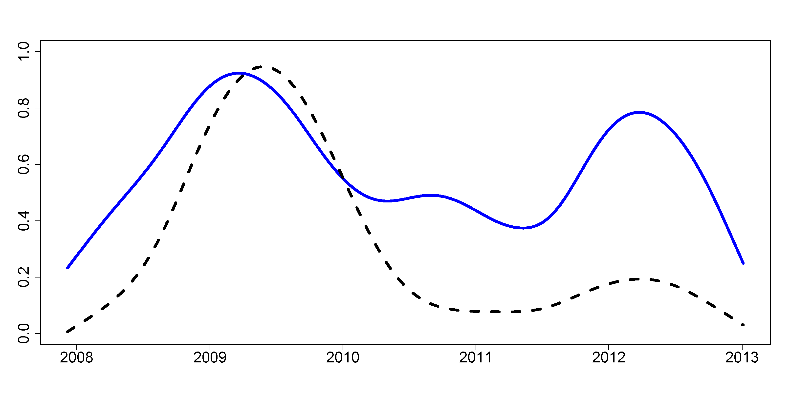

[](http://quantlet.de/index.php?p=info)

## [](http://quantlet.de/) **TENET_total_connectedness** [](http://quantlet.de/d3/ia)

```yaml
Name of QuantLet: TENET_total_connectedness

Published in: TENET

Description: 'Plots the total connectedness and the averaged lambda of 100 financial institutions
from 20071207 to 20130105.'

Keywords: 'tail, quantile regression, CoVaR, systemic Risk, variable selection, dimension
reduction'

Author: Lining Yu

Submitted:

Datafile: total_connectedness_and_averaged_lambda.csv

Example: 'Plot of the total connectedness (blue solid line) and the averaged lambda (black dashed
line) of 100 financial institutions.'
```




```r

# clear all variables
rm(list = ls(all = TRUE))
graphics.off()

# read the file of total connectedness and averaged lambda
f = read.csv("total_connectedness_and_averaged_lambda.csv")
dt = as.Date(f[, 1], format = "%d/%m/%Y")
total.c = as.vector(f[, 2])
average_lambda = as.vector(f[, 3])

# scale the total connectedness and averaged lambda into 0 and 1
total.c = (total.c - min(total.c))/(max(total.c) - min(total.c))
average_lambda = (average_lambda - min(average_lambda))/(max(average_lambda) - min(average_lambda))

plot(dt, total.c, ylab = "", xlab = "", pch = 16, col = "white", cex.axis = 1.8, font.axis = 1.8)
lines(smooth.spline(dt, total.c, spar = 0.8), lwd = 5, col = "blue")
lines(smooth.spline(dt, average_lambda, df = 5, spar = 0.8), col = "black", lty = 2, 
      lwd = 5)

```
