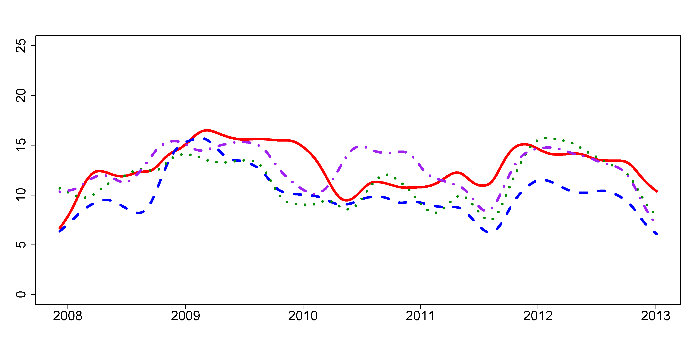
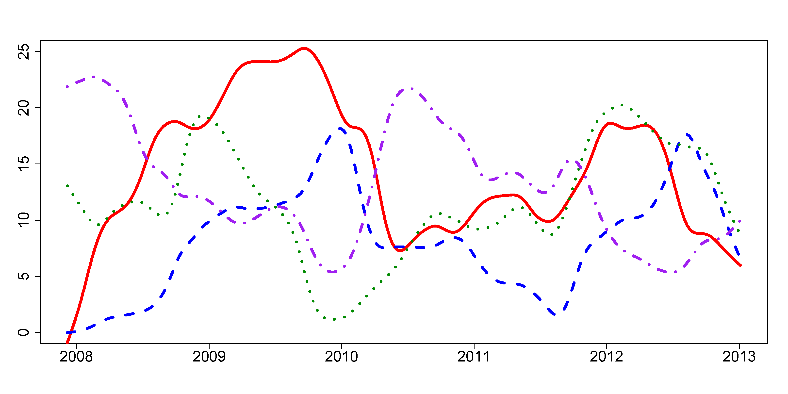

[](http://quantlet.de/)

## [](http://quantlet.de/) **TENET_total_in_out_groups** [](http://quantlet.de/)

```yaml

Name of QuantLet : TENET_total_in_out_groups

Published in : TENET

Description : 'Plots the total incoming and outgoing links of four financial industry groups:
Depositories (red solid line), Insurances (blue dashed line), Broker-Dealers (green dotted line),
Others (violet dash-dot line)'

Keywords : tail, quantile regression, CoVaR, systemic Risk, variable selection, dimension reduction

Author : Lining Yu

Datafile : total_in_and_out.csv

Example : 'Plot of the total incoming connectedness of four groups: Depositories (red solid line),
Insurances (blue dashed line), Broker-Dealers (green dotted line), Others (violet dash-dot line),
Plot of the total outgoing connectedness of four groups: Depositories (red solid line), Insurances
(blue dashed line), Broker-Dealers (green dotted line), Others (violet dash-dot line)'

```






### R Code:
```r

# clear all variables
rm(list = ls(all = TRUE))
graphics.off()

# set the working directory setwd('C:/...')

f            = read.csv("total_in_and_out.csv")
dt           = as.Date(f[, 1], format = "%d/%m/%Y")

# total incoming links of four groups
total.in.b   = as.vector(f[, 2])
total.in.ins = as.vector(f[, 3])
total.in.d   = as.vector(f[, 4])
total.in.o   = as.vector(f[, 5])

# banks with incoming links
plot(dt, total.in.b, type = "l", col = "white", lwd = 5, ylab = "", xlab = "", cex.axis = 1.8, 
  font.axis = 1.8, ylim = range(0, 25))
lines(smooth.spline(dt, total.in.b, spar = 0.5), lwd = 5, col = "red")

# insurers with incoming links
lines(smooth.spline(dt, total.in.ins, spar = 0.5), lty = 2, col = "blue", lwd = 5)

# broker dealers with incoming links
lines(smooth.spline(dt, total.in.d, spar = 0.5), lty = 3, col = "green4", lwd = 5)

# others with incoming links
lines(smooth.spline(dt, total.in.o, spar = 0.5), lty = 4, col = "purple", lwd = 5)

# total outgoing links of four groups
total.out.b   = as.vector(f[, 6])
total.out.ins = as.vector(f[, 7])
total.out.d   = as.vector(f[, 8])
total.out.o   = as.vector(f[, 9])

# banks with outgoing links
dev.new()
plot(dt, total.out.b, type = "l", col = "white", lwd = 5, ylab = "", xlab = "", cex.axis = 1.8, 
  font.axis = 1.8, ylim = range(0, 25))
lines(smooth.spline(dt, total.out.b, spar = 0.5), lwd = 5, col = "red")

# insurers with outgoing links
lines(smooth.spline(dt, total.out.ins, spar = 0.5), lty = 2, col = "blue", lwd = 5)

# broker dealers with outgoing links
lines(smooth.spline(dt, total.out.d, spar = 0.5), lty = 3, col = "green4", lwd = 5)

# others with outgoing links
lines(smooth.spline(dt, total.out.o, spar = 0.5), lty = 4, col = "purple", lwd = 5) 

```
